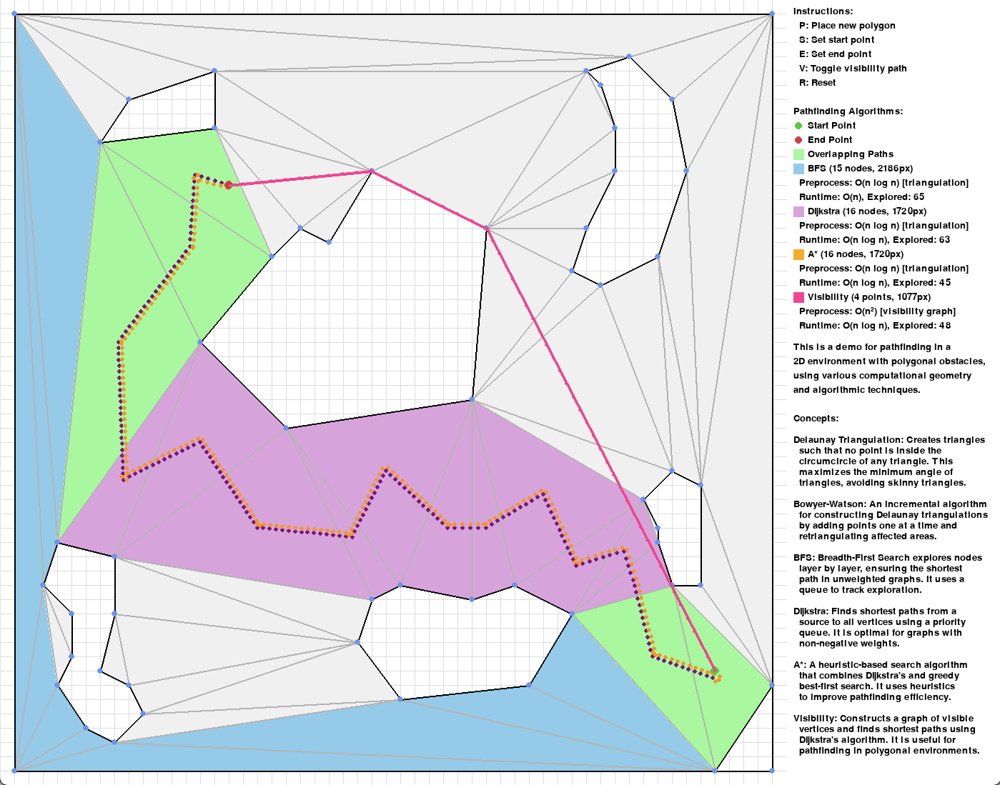

# Pathfinding with Computational Geometry

An interactive demonstration of pathfinding algorithms in a 2D environment with polygonal obstacles, leveraging computational geometry techniques.

## Mathematical Foundation

### Triangulation
The demo uses Delaunay triangulation to decompose the navigable space. A Delaunay triangulation $$DT(P)$$ of a point set $$P$$ is characterized by the empty circle property: no point in $$P$$ lies inside the circumcircle of any triangle in $$DT(P)$$. This property maximizes the minimum angle of all triangles, avoiding degenerate (skinny) triangles.

### Graph Construction
The triangulation induces a dual graph $$G = (V, E)$$ where:
- $$V$$ represents triangle centroids
- $$E$$ connects adjacent triangles
- Edge weights $$w(e)$$ are Euclidean distances between centroids

## Pathfinding Algorithms

### Breadth-First Search (BFS)
- Time Complexity: $$O(|V| + |E|)$$
- Space Complexity: $$O(|V|)$$
- Finds shortest path in terms of triangle count
- Preprocessing: $$O(n \log n)$$ for triangulation

### Dijkstra's Algorithm
- Time Complexity: $$O(|E| \log |V|)$$ with binary heap
- Returns optimal path considering Euclidean distances
- Preprocessing: $$O(n \log n)$$ for triangulation

### A* Search
- Time Complexity: $$O(|E| \log |V|)$$ worst case
- Heuristic: $$h(v) = \text{Euclidean}(v, t)$$ where $$t$$ is target
- Admissible and consistent heuristic guarantees optimality
- Preprocessing: $$O(n \log n)$$ for triangulation

### Visibility Graph
- Constructs shortest path through visible vertices
- Preprocessing: $$O(n^2)$$ for visibility graph construction
- Runtime: $$O(|E| \log |V|)$$ using Dijkstra's on visibility graph
- Optimal path length in continuous space

## Implementation Details

The environment is discretized using a grid system for vertex placement. Collision detection uses computational geometry primitives including:
- Point-in-polygon tests
- Line segment intersection
- Polygon-polygon intersection

## Usage

Keys:
- `P`: Place polygon vertices
- `S`: Set start point
- `E`: Set end point
- `V`: Toggle visibility path
- `R`: Reset environment

The demo visualizes all paths simultaneously, using distinct colors to show how different algorithms traverse the space. Path lengths and nodes explored are displayed in real-time.
